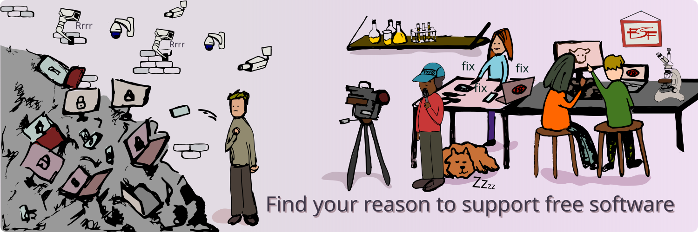

### about me
- a passionate software engineer with expertise in Java, Spring Boot, React, PostgreSQL and more. 
building robust, scalable web applications using architectures and design patterns
- i love hobby engineering, free/libre software, repair-friendly products and anything well engineered and documented
- full time observer and tinkerer

### Deployed Projects
- [atsfs.com](https://atsfs.com) <i>A Job Application Tracker To Manage Applications on Multiple Platforms</i>
- [reporead.vercel.app](https://reporead.vercel.app) <i>Using AI to create a README.md for any GitHub repository in just seconds</i>.

<strong>Blog Posts</strong>

- [Domain Models](https://blog.kurttekin.com/2024/11/domain-models.html)
- [Dependency Injection](https://blog.kurttekin.com/2024/09/dependency-injection.html)
- [How To Secure Your Spring Application](http://blog.kurttekin.com/2024/08/how-to-secure-your-spring-application.html)
- [Event Sourcing Pattern](http://blog.kurttekin.com/2024/08/event-sourcing-pattern.html)
- [Immutability](http://blog.kurttekin.com/2024/08/immutability-in-software-design.html)
- [Onion Architecture](http://blog.kurttekin.com/2024/07/onion-architecture.html)
- [Design Patterns](http://blog.kurttekin.com/2024/06/design-patterns.html)

  
<strong>Books</strong>

  
|  | Books |
| --- | --- |
| `X` | 📖 [Free Software, Free Society: Selected Essays of Richard M. Stallman]() |
| `X` | 📖 [Software Engineering - Ian Sommerville]() |
| `X` | 📖 [Design Patterns - Gang Of Four]() |
| `X` | 📖 [Clean Code: A Handbook of Agile Software Craftsmanship - Robert C. Martin]() |
| `X` | 📖 [Dive Into Design Patterns - Alexander Shvets]() |
| `X` | 📖 [Spring Microservices in Action - John Carnell, Illary Huaylupo Sánchez]() |
| `X` | 📖 [Spring Start Here Learn what you need and learn it well - Laurentiu Spilca]() | 
|     | 📖 [Patterns of Enterprise Application Architecture - Martin Fowler]() |
| `X` | 📖 [Domain-Driven Design - Eric Evans]() |
|     | 📖 [Test Driven Development - Kent Beck]() |
|     | 📖 [Algorithms - Robert Sedgewick]() |
| `X` | 📖 [A Common-Sense Guide to Data Structures and Algorithms - Jay Wengrow]() |
|     | 📖 [Grokking Algorithms - Aditya Bhargava]() |
|     | 📖 [The Pragmatic Programmer - David Thomas, Andrew Hunt]() |

<strong>Bookmarks</strong>

- [Technology Connections](https://www.youtube.com/@TechnologyConnections)
- [Computerphile](https://www.youtube.com/@Computerphile)
- [ThePrimeagen](https://www.youtube.com/@ThePrimeTimeagen)
- [Low Level Learning](https://www.youtube.com/@LowLevelLearning)
- [David Bombal](https://www.youtube.com/@davidbombal)
- [bigclivedotcom](https://www.youtube.com/@bigclivedotcom)
- [fern](https://www.youtube.com/@fern-tv)

  
<strong>Repositories</strong>

 

https://www.youtube.com/watch?v=3LopI4YeC4I

