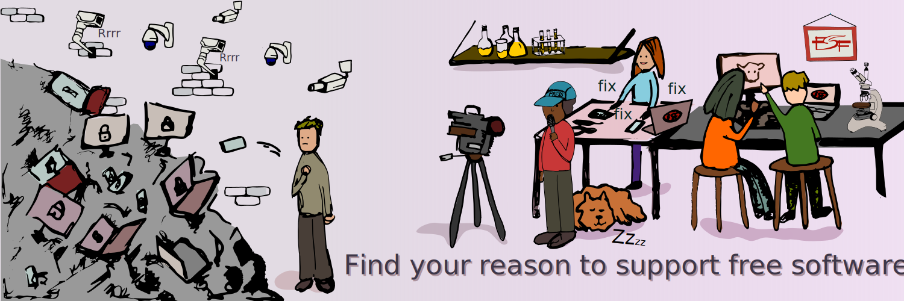

### > i'm looking for a job, if you are hiring or know someone contact me via email

### about me
- focusing on back-end development
- i currently learn java and spring
- i love hobby engineering, libre software, repair-friendly products and anything well engineered for engineers by engineers
- full time observer and tinkerer; cannot resist fixing problems i encounter around

#### blog posts
- [Dependency Injection](https://can.kurttekin.com/2024/09/dependency-injection.html)
- [How To Secure Your Spring Application](http://can.kurttekin.com/2024/08/how-to-secure-your-spring-application.html)
- [Event Sourcing Pattern](http://can.kurttekin.com/2024/08/event-sourcing-pattern.html)
- [Immutability](http://can.kurttekin.com/2024/08/immutability-in-software-design.html)
- [Onion Architecture](http://can.kurttekin.com/2024/07/onion-architecture.html)
- [Design Patterns](http://can.kurttekin.com/2024/06/design-patterns.html)

#### books
- [x] 📖 [Free Software, Free Society: Selected Essays of Richard M. Stallman]()
- [x] 📖 [Software Engineering - Ian Sommerville]()
- [X] 📖 [Design Patterns - Gang Of Four]()
- [X] 📖 [Clean Code: A Handbook of Agile Software Craftsmanship - Robert C. Martin]()
- [X] 📖 [Dive Into Design Patterns - Alexander Shvets]()
- [X] 📖 [Spring Microservices in Action - John Carnell, Illary Huaylupo Sánchez]()
- [X] 📖 [Spring Start Here Learn what you need and learn it well - Laurentiu Spilca]() 
- [ ] 📖 [Patterns of Enterprise Application Architecture - Martin Fowler]()
- [X] 📖 [Domain-Driven Design - Eric Evans]()
- [ ] 📖 [Test Driven Development - Kent Beck]()
- [ ] 📖 [Algorithms - Robert Sedgewick]()
- [X] 📖 [A Common-Sense Guide to Data Structures and Algorithms - Jay Wengrow]()
- [ ] 📖 [Grokking Algorithms - Aditya Bhargava]()
- [ ] 📖 [The Pragmatic Programmer - David Thomas, Andrew Hunt]()

##### some of my favorite video content creators currently
- [Low Level Learning](https://www.youtube.com/@LowLevelLearning)
- [bigclivedotcom](https://www.youtube.com/@bigclivedotcom)
- [Technology Connections](https://www.youtube.com/@TechnologyConnections)
- [Computerphile](https://www.youtube.com/@Computerphile)
- [David Bombal](https://www.youtube.com/@davidbombal)
- [Flu TV](https://www.youtube.com/@flu)

